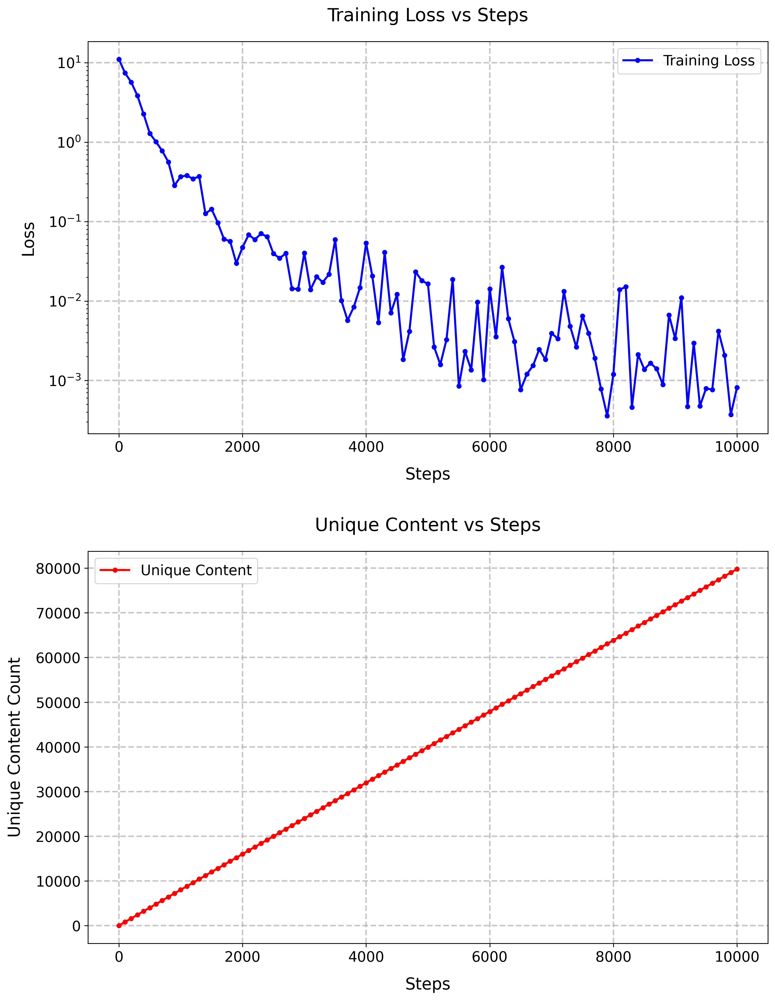

# SmolLM2-DeepSeek Implementation

This repository contains an implementation of a language model that combines SmolLM2 architecture with DeepSeek-style improvements, specifically incorporating Multi-Head Latent Attention (MLHA) and Mixture of Experts (MoE) with loss-less load balancing.

## Model Configuration
Following parameters are used to make the model smaller (254.8M parameters) and train for 10,000 steps on local machine:
```python
    hidden_size: int = 384
    intermediate_size: int = 1024
    num_hidden_layers: int = 24
    num_attention_heads: int = 6
    num_key_value_heads: int = 2
```

## Training Log [log_training.md](log_training.md)

## Sample Outputs [sample_outputs.md](sample_outputs.md)

## Loss and Unique Content Plot
The loss and unique content plot is generated using the `plots.py` script shown below:


## Architecture Overview

The model implements two key architectural innovations from DeepSeek:

1. **Multi-Head Latent Attention (MLHA)**
   - Reduces computation and memory costs while maintaining model quality
   - Uses fewer key-value heads than query heads (num_key_value_heads < num_attention_heads)
   - Implements efficient head sharing through repeat_interleave operations
   - Found in `DeepSeekV3Attention` class in `model.py`

2. **Mixture of Experts with Loss-less Load Balancing**
   - Implements MoE layer with 8 experts and top-k routing (k=2)
   - Uses loss-less load balancing strategy (no auxiliary loss term)
   - Each token is processed by multiple experts with averaged results
   - Implemented in `DeepSeekExpertLayer` and `DeepSeekMoE` classes

## Key Components

### Model Architecture (`model.py`)

- **DeepSeekV3Config**: Configuration class for model hyperparameters
- **RMSNorm**: Efficient normalization layer
- **DeepSeekV3Attention**: MLHA implementation
- **DeepSeekMoE**: MoE implementation with loss-less load balancing
- **DeepSeekV3Model**: Main transformer model
- **DeepSeekV3ForCausalLM**: Causal language model wrapper

### Training Script (`train.py`)

The training script includes:
- Data loading and preprocessing
- Training loop with checkpointing
- Text generation capabilities
- Metrics tracking
- Model saving in HuggingFace format


## Training
To train the model,
1. Set up environment variable:
```bash
export HF_TOKEN="your_huggingface_token"
```

2. Run the training script:
```bash
python train.py
```

The training script includes:
- Automatic device selection (CUDA/MPS/CPU)
- Progressive checkpointing
- Sample generation during training
- Metrics logging

## Key Features

1. **MLHA Implementation**
   - Efficient attention mechanism with shared key-value heads
   - Reduces parameter count while maintaining performance
   - Implements rotary positional embeddings (RoPE)

2. **MoE Architecture**
   - 8 expert networks with top-2 routing
   - Loss-less load balancing for efficient training
   - Balanced token distribution across experts

3. **Training Optimizations**
   - Gradient clipping
   - Learning rate warmup
   - Regular checkpointing
   - Metrics tracking

## Requirements

- PyTorch
- Transformers
- Datasets
- tqdm
- huggingface_hub

## Monitoring and Outputs

The training process generates:
- Regular checkpoints
- Training metrics
- Generated text samples
- Model saves in HuggingFace format

## Implementation Details

The codebase combines SmollM2's efficient architecture with DeepSeek's improvements:

1. **Attention Mechanism**
   ```python
   num_heads = 6
   num_key_value_heads = 2
   num_key_value_groups = num_heads // num_key_value_heads
   ```

2. **MoE Configuration**
   ```python
   num_experts = 8
   top_k = 2
   ```

3. **Architecture Size**
   - 24 transformer layers
   - 384 hidden dimensions
   - 1024 intermediate size

